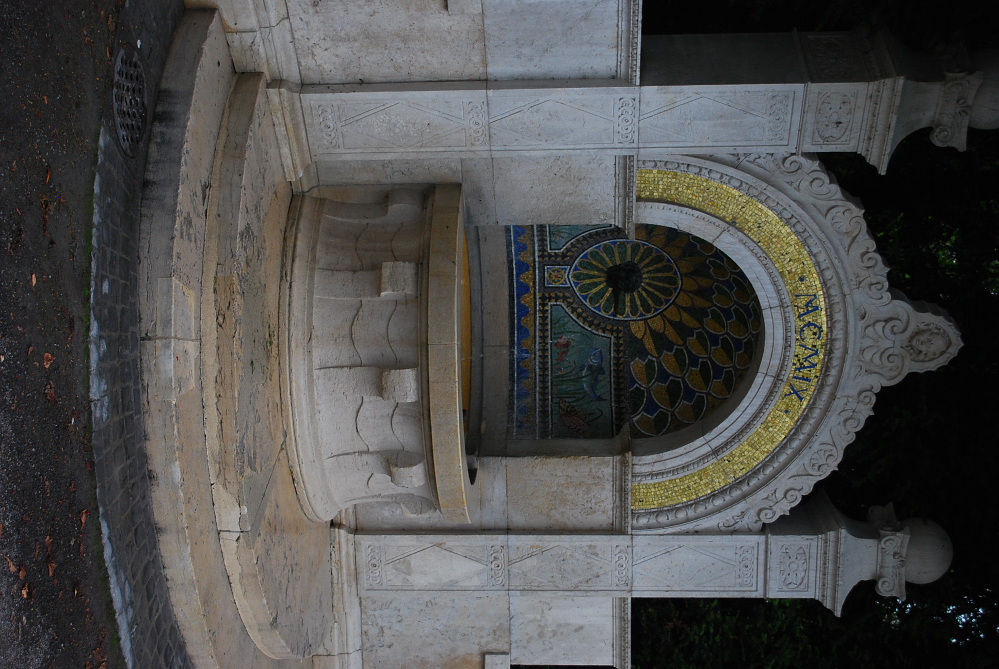
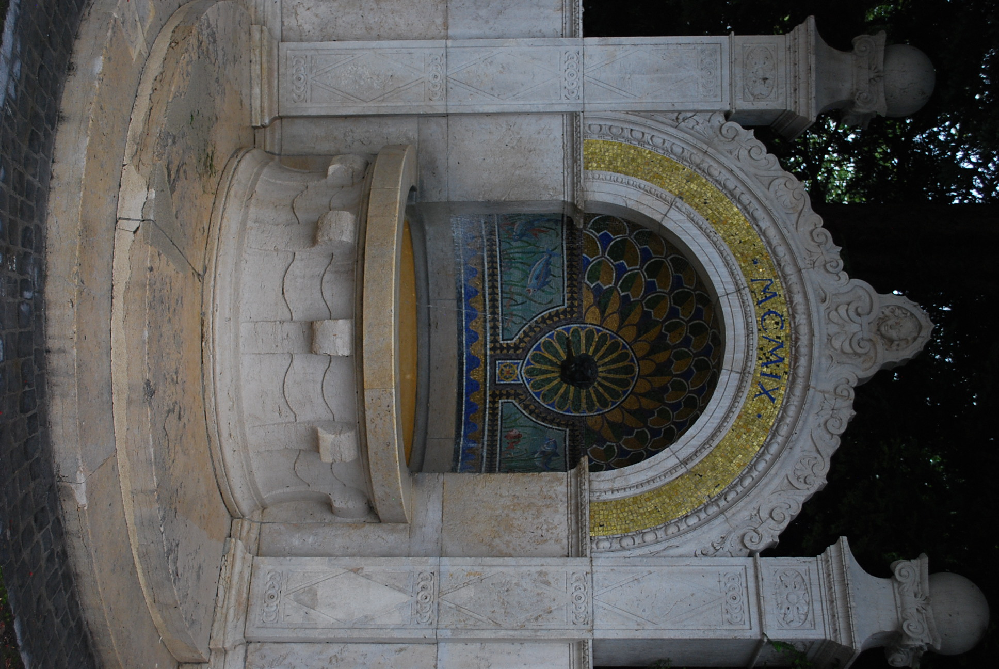
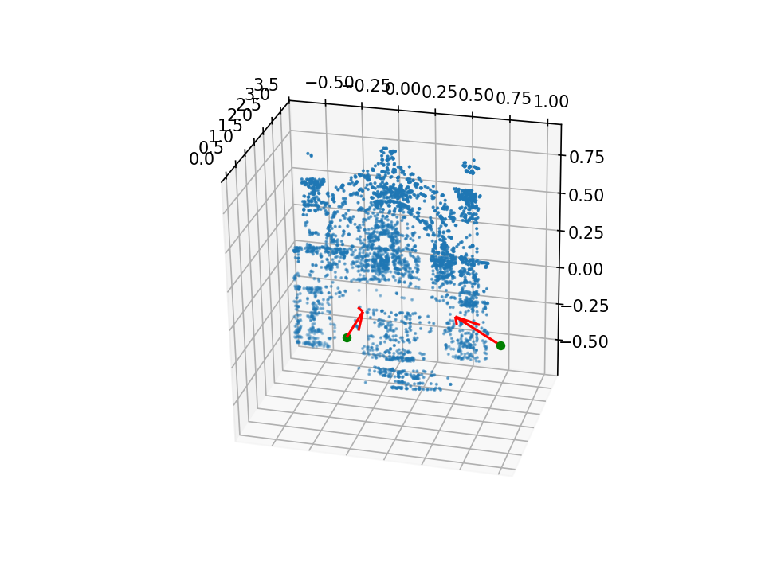
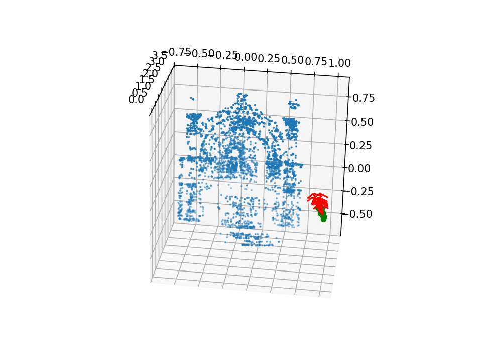
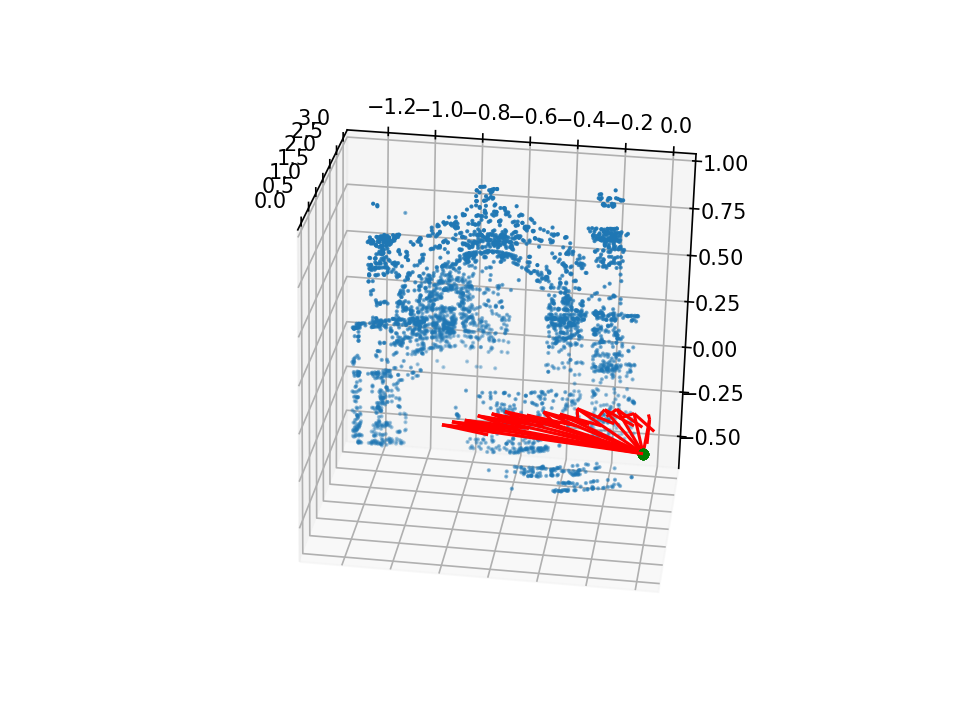
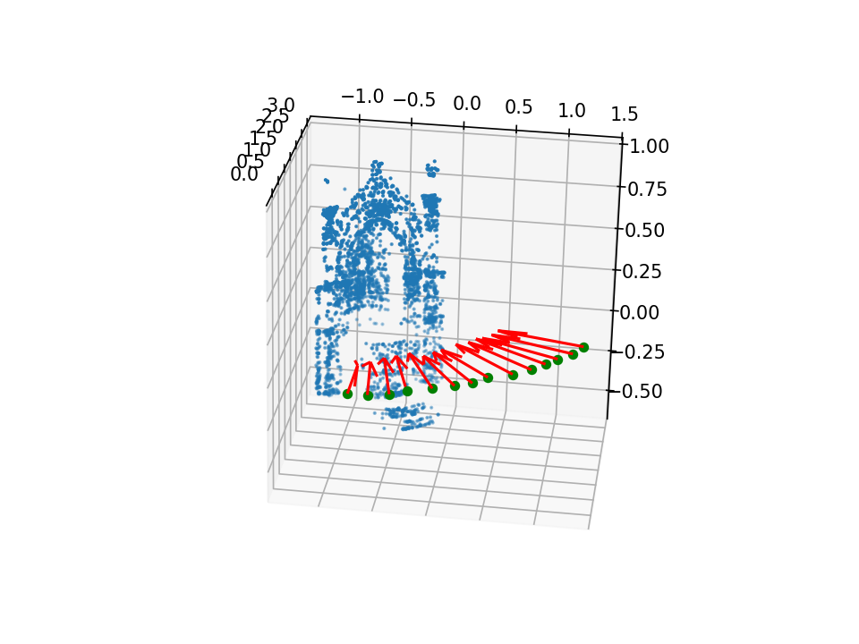
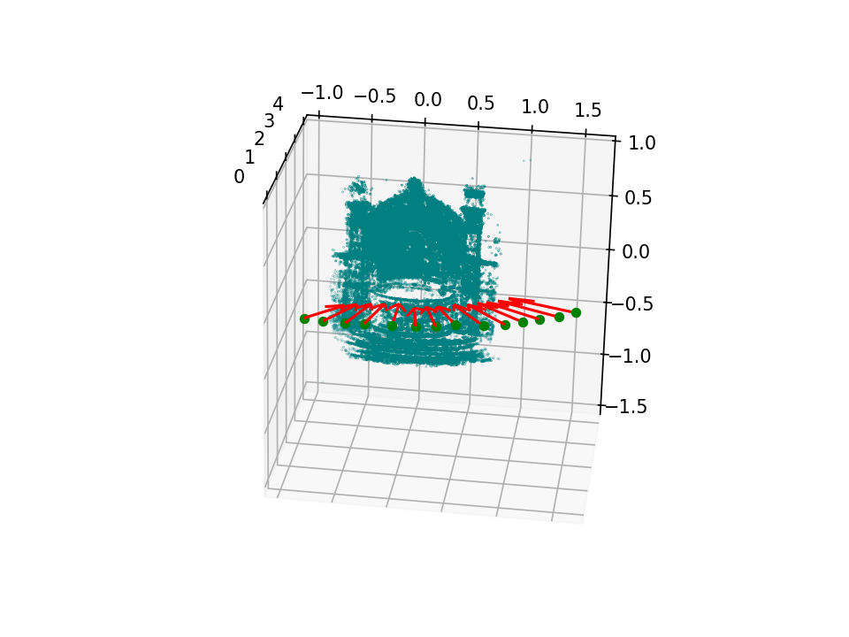

# Project aim

This project was aimed at creating a structure from motion pipeline in order to reconstruct 3D structure from 2D point correspondances

## Pipeline 
### Images
Multiple images such as this one were selected  
***
 
***
and this one 
***
 
***
was selected.  

### Keypoint extraction
Two images suitable as inital pair were run through a SIFT algorithm to extract keypoints.  
WIth the keypoint one can estimate a essential matrix and with that one can estimate 3D points and realtive camera positions. The result can be viewed in the image below. 
 As might be visable in the figure the left most camera is set to the identity matrix and the rightmost is the relative rotation from that camera.  
***
 
***
### Estimating cameras  

To get a better estimation of the points more correspondances could be used. 
With the initial point corresponadances a fundamental matrix could be extracted and from that the realtive rotations. The rotations were taken as realtive to an baseline rotation that was defined as the identity matrix. 
Extracting the realtive rotations and setting their translation to 0 gave the following result:  
***
  
***
After this, one rotation was set to be the identity matrix and the other ones were chained together to create the next image:
***
 
***
We can see that the rotations follow a smooth pattern which is also how the camera was moving when taking the pictures.   
The translations between the cameras were estimated through a RANSAC algorithm with the now known rotations matrises. 
***
 
***
### Final result
All points that were estimated were then plotted together with the estimated camera poses to create the final reconstruction. 
***
 

